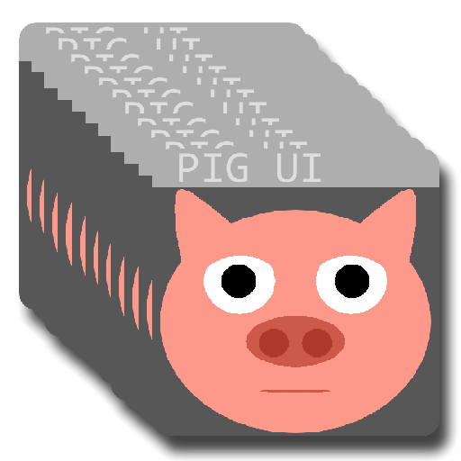

## A Pygame-Based UI Element Framework



pigUI is a modular, event-driven framework built on **Pygame** designed for creating **ui / ui-styles(ux)**. It provides all the necessary low-level components—from a robust UI manager and specialized widgets to a smooth Bézier curve drawing utility—to quickly prototype and build graphical programming tools.

---

## ✨ Features Overview

* **Hierarchical UI Management:** The `UIManager` handles element layering, rendering order, and ensures **input blocking** (only the top/active element, like a dragged node or a text input, receives events).
* **Intuitive Event Handling:** The `Events` class abstracts raw Pygame events (mouse clicks, double-clicks, wheel scroll, keyboard input) into simple, clean state variables.
* **Specialized UI Widgets:** Includes complex, ready-to-use components like `UITextInput` (with key repeat and validation), `UIDropDown`, `UIMenuBar`, and an `UIColorPicker`.
* **Customizable Aesthetics:** The separation of logic (`UIElement`) and visuals (`UXElement`/`UXWrapper`) allows for easy theme changes and custom component rendering.

---

## 🛠️ Installation and Setup

### Prerequisites

You need **Python 3.x** installed.

### Install

PyNodle requires **Pygame** and **NumPy** (used for array manipulation in the color picker and potentially other areas).

```bash
pip install -r requirements.txt
```
#### The package
```bash
pip install jmpUI
```

## 🚀 Usage and Extending
The application's core logic runs in app.py. The UIManager (UIM) manages every component you create.

### Implementing Custom Interactions
All custom components should inherit from UIElement and override the appropriate callback methods.

### 🤝 Contributing
We welcome contributions, bug reports, and feature requests! Please feel free to open an issue or submit a pull request.

### 📜 License
This project is licensed under the GPL V3 License.